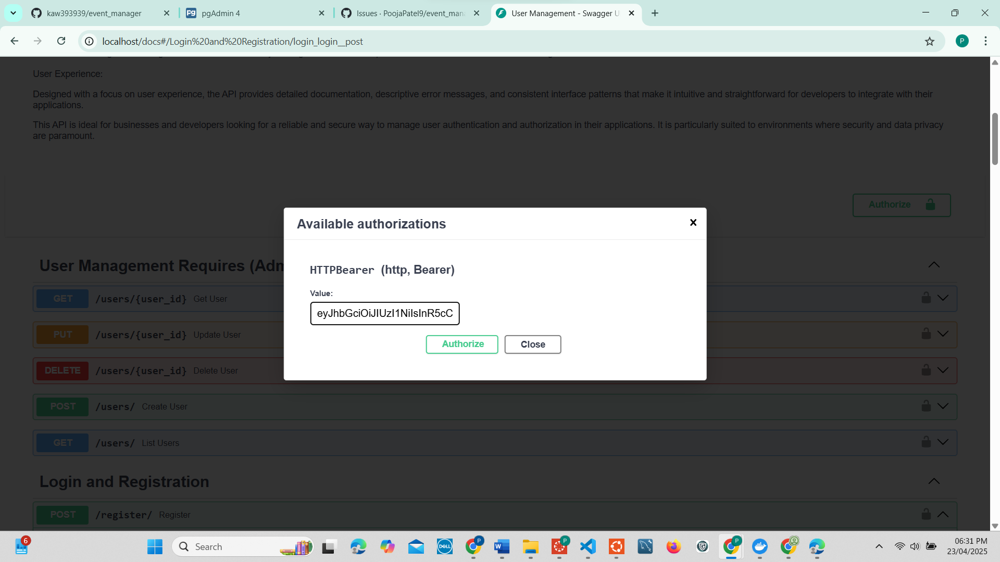

# [my github repository linK](https://github.com/PoojaPatel9/event_manager_HW_10.git)

- This document tracks known issues encountered during the development and testing of the Event Manager HW 10 project, along with their corresponding solutions.

# issue and solution

## [#1 Unable to Login After Registration (500 Error)](https://github.com/PoojaPatel9/event_manager_HW_10/issues/1)

- Login failed after registration due to missing email verification
- Fix: Verified email manually and followed recommended flow to avoid this in future

## [#2 TypeError with `create_access_token()` in Tests](https://github.com/PoojaPatel9/event_manager_HW_10/issues/2)

- Running `pytest` caused:
```
TypeError: create_access_token() takes 0 positional arguments but 1 was given
```
- Solution: Updated fixtures in `tests/conftest.py` to pass a `data` dictionary

---
## [#3 Swagger UI Not Showing Token Input](https://github.com/PoojaPatel9/event_manager_HW_10/issues/3)

- Missing token input box under `/docs` Swagger UI
- Swagger showed username/password fields instead of OAuth2 token input
- Fix: Updated `main.py` and `dependencies.py` to configure OpenAPI security schema properly


---
## [#4 403 Forbidden for Admin Access to `/users/{user_id}`](https://github.com/PoojaPatel9/event_manager_HW_10/issues/4)

- Error: `{"detail": "403: Operation not permitted"}`
- Reason: Default user role was "AUTHENTICATED", not "ADMIN" or "MANAGER"
- Solution: Manually updated the user role in PostgreSQL via PGAdmin
- The route uses:
```python
current_user: dict = Depends(require_role(["ADMIN", "MANAGER"]))
```

---
## [#5 Password Validation](https://github.com/PoojaPatel9/event_manager_HW_10/issues/5)

- Previously, any password was accepted.
- Added password validation in `user_schema.py`:
  - Minimum 8 characters
  - At least 1 uppercase, 1 lowercase, 1 digit, and 1 special character


---
## [#6 Username Validation](https://github.com/PoojaPatel9/event_manager_HW_10/issues/6)

- Only allows letters (a-z, A-Z), digits (0-9), underscores (_), and hyphens (-)
- No spaces or special characters allowed
- Minimum 3 characters, maximum 30 characters  
Validation added in `user_schemas.py`:
```python
nickname: Optional[str] = Field(
    None, min_length=3, max_length=30, pattern=r'^[a-zA-Z0-9_-]+$'
)
```

---


# [DockerHub Deployment](https://hub.docker.com/repository/docker/poojapatel9/event_manager_hw_10)


# Reflection on Learning

- This project provided me with an in-depth understanding of backend REST API development, testing, and debugging using FastAPI, PostgreSQL, and Docker. I developed advanced skills in request validation with Pydantic, async database handling using SQLAlchemy, and JWT-based authentication. I also gained experience configuring custom OpenAPI documentation to improve Swagger UI usability, especially around token handling.

- From a QA perspective, I improved my ability to write thorough automated tests with pytest, identify and document bugs in GitHub Issues, and validate application behaviors through manual and programmatic testing. I learned the importance of edge case coverage, such as verifying unique email constraints and enforcing field validation. This experience also enhanced my familiarity with DevOps tools like Docker and Git workflows, especially branching, pull requests, and version control.

- Overall, this assignment sharpened both my technical proficiency and my collaborative mindset, preparing me to contribute effectively to real-world software QA and development teams.